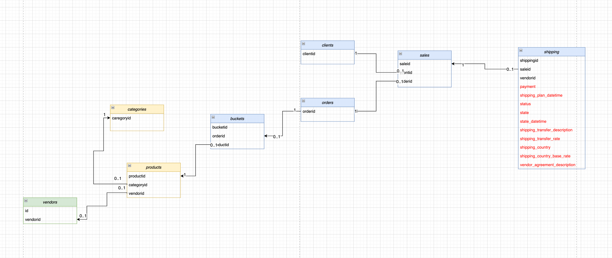
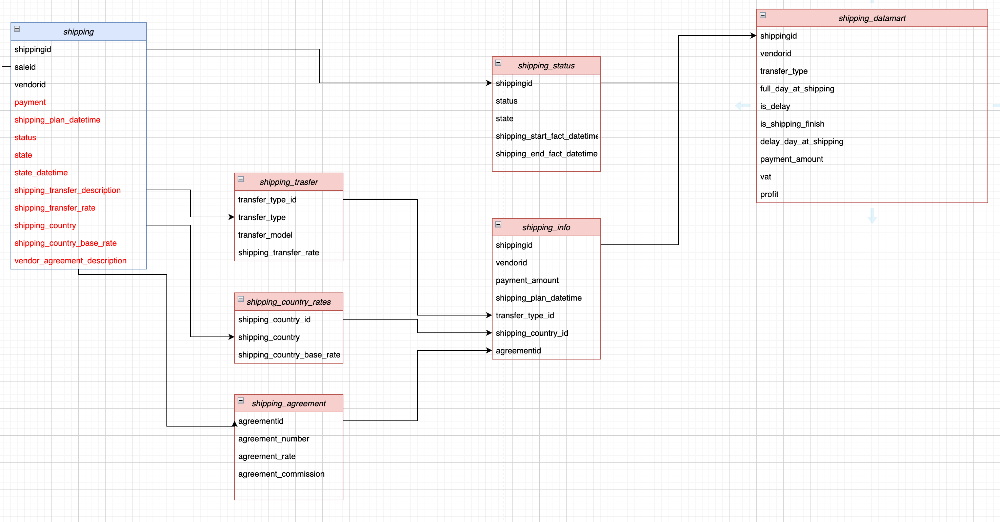

# The 2nd project
Task: optimize the load on the storage by migrating data into separate logical tables, and then building a data mart on them.

### ER-diagram before

### ER-diagram after

## Project plan

1. Create a directory of shipping costs to countries `shipping_country_rates` from the data specified in `shipping_country` and `shipping_country_base_rate`, make the primary key of the table - serial `id`, that is, the serial identifier of each row. Name the serial key `id`. The directory must consist of unique pairs of fields from the shipping table.

2. Create a directory of vendor delivery rates under the `shipping_agreement` contract from the data of the `vendor_agreement_description` line separated by ":". Field names:
- `agreementid` PK,
- `agreement_number`,
- `agreement_rate`,
- `agreement_commission`.

3. Create a guide about shipping types `shipping_transfer` from the string `shipping_transfer_description` separated by `:`.
Field names:
- `transfer_type` serial PK,
- `transfer_model`,
- `shipping_transfer_rate` .

4. Create a table `shipping_info` with unique deliveries `shippingid` and link it to the created references `shipping_country_rates`, `shipping_agreement`, `shipping_transfer` and constant shipping information `shipping_plan_datetime`, `payment_amount`, `vendorid`.

5. Create a shipping status table `shipping_status` and include information from the `shipping (status , state)` log. Add there computable information on the actual delivery time `shipping_start_fact_datetime`, `shipping_end_fact_datetime`. Reflect for each unique `shippingid` its final delivery status.

6. Create a `shipping_datamart` view based on ready-made tables for analytics and include in it:
- `shippingid`
- `vendorid`
- `transfer_type` — delivery type from shipping_transfer
- `full_day_at_shipping` — the number of full days the delivery took. Calculated as: `shipping_end_fact_datetime-shipping_start_fact_datetime`.
- `is_delay` - status indicating whether the delivery is overdue. Calculated as: `shipping_end_fact_datetime > shipping_plan_datetime → 1 ; 0`
- `is_shipping_finish` - status indicating that the delivery is completed. If final `status = finished → 1; 0`
- `delay_day_at_shipping` - the number of days the delivery was overdue. Calculated as: `shipping_end_fact_datetime > shipping_end_plan_datetime → shipping_end_fact_datetime - shipping_plan_datetime ; 0`.
- `payment_amount` — user's payment amount
- `vat` — total shipping tax. Calculated as: `payment_amount * ( shipping_country_base_rate + agreement_rate + shipping_transfer_rate)` .
- `profit` — the company's total income from delivery. Calculated as: `payment_amount * agreement_commission`.

## Scripts secuence, run it one by one

- 1_create_tables.sql

- 2_data_import.sql

- 3_create_temp_tables.sql

- 4_temp_tables_query.sql

- 5_shipping_datamart_view.sql
