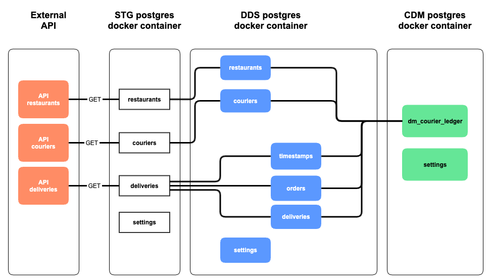
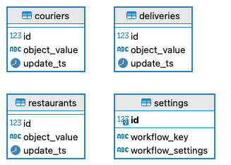
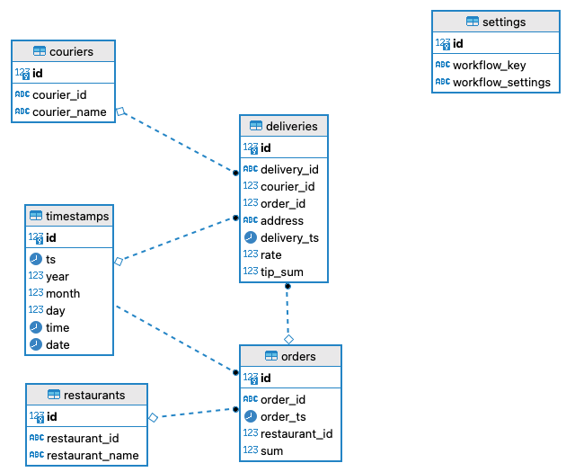
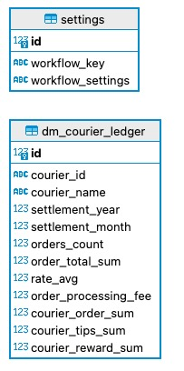

# The 5th project 

### Description
Couriers work is to deliver orders. The objective of this project is to develop a data mart for calculating payments with couriers. The essence of the task is to implement ETL processes that will transform and move data from sources to the final data layers of the DWH. The data must be taken from the courier service API, and then combined with the local subsystem.

### ETL from external API to local database



### STG layer 

has been developed for storing raw data from the source



### DDS layer

has been developed unparse and structure raw data



### CDM layer

has been developed to show result to the final client



### How to work with the repository

1. Copy the repository to your local machine:
	* `git clone https://github.com/{{ username }}/de-project-sprint-5.git`
2. Change to the project directory: 
	* `cd de-project-sprint-5`
3. Run docker-compose:
```
docker-compose up -d
```
4. After the container starts, you will have access to:
- Airflow
	- `localhost:3000/airflow`
- Database
	- `jovyan:jovyan@localhost:15432/de`


### Repository structure
- `/src/dags`
- `/pics/`

### Virtual environment:

Creating a virtual environment

`python3 -m venv venv`

Activation of the virtual environment:

`source venv/bin/activate`

Update pip to latest version:

`pip install --upgrade pip`

Install Dependencies:

`pip install -r requirements.txt`

