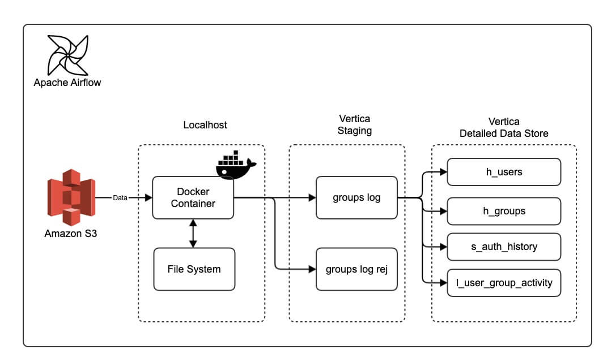
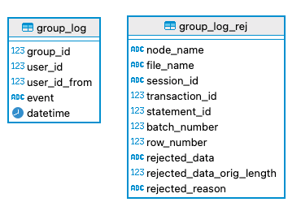
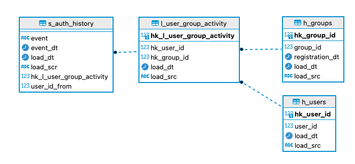

# The 6th project

### Description
The task is to build an analytical storage based on Vertica using Data Vault storage model. Data is kept on Amazon s3 service. Data pipeline should be done with a following sequence (s3 - localhost in Docker Container - Vertica STG - Vertica DDS) and implemented with Apache Airflow.

### ETL pipeline



### STG layer 

has been developed for storing raw data from the source



### DDS layer

has been developed unparse and structure raw data



### How to work with the repository

1. Copy the repository to your local machine:
	* `git clone https://github.com/{{ username }}/de-project-sprint-6.git`
2. Change to the project directory: 
	* `cd de-project-sprint-6`
3. Run docker-compose:
```
docker-compose up -d
```
4. After the container starts, you will have access to:
- Airflow
	- `localhost:3000/airflow`
- Database
	- `vertica connection secured`
5. Create a virtual environment

`python3 -m venv venv`

6. Activation of the virtual environment:

`source venv/bin/activate`

7. Update pip to latest version:

`pip install --upgrade pip`

8. install vertical python in container

`pip install vertica_python`

9. install vertical hooks in container

`pip install apache-airflow-providers-vertica[common.sql]`

### Repository structure
- `/src/dags`
- `/pics/`
- `/data/`


