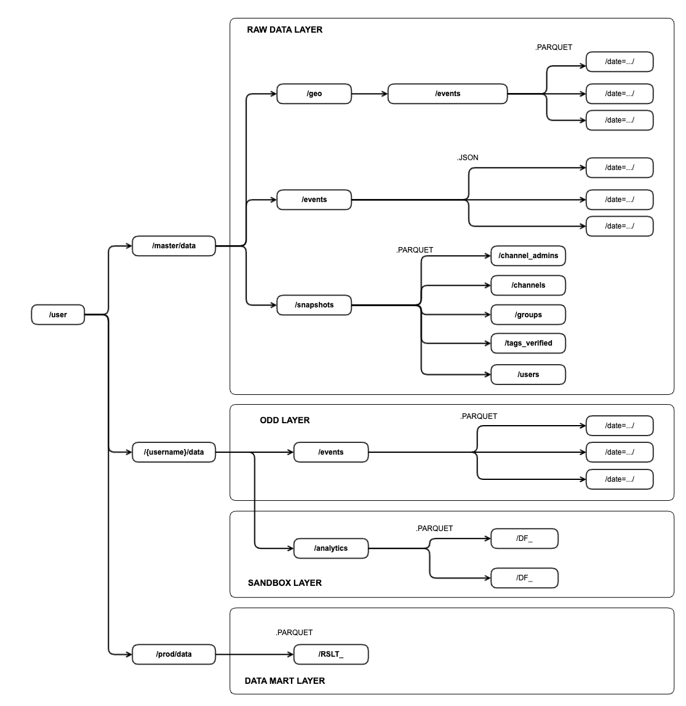
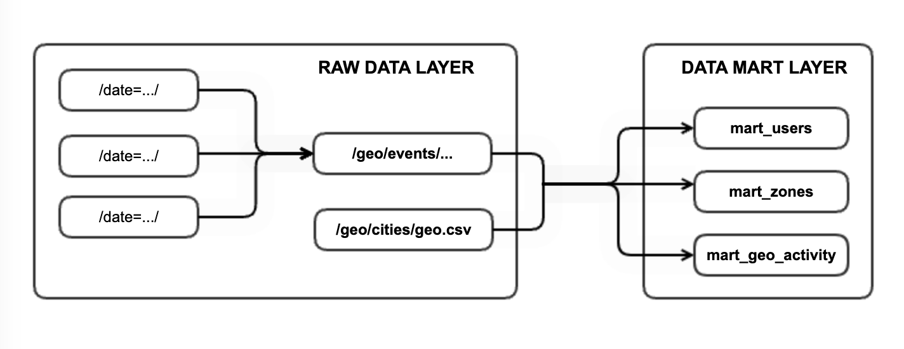
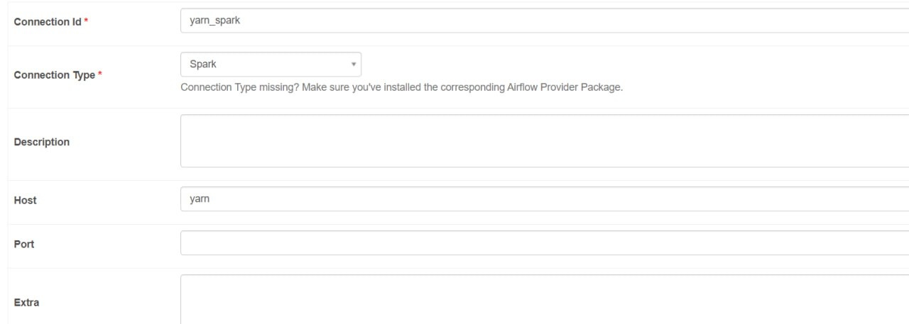

# The 7th project

### Description

There is a plan to to create new features in the existing product (social network). Foremost, the new recommendation system should be intruduced in upcuming month. The application will prompt the user to write to the person if they: 
- subscribed to the same channel
- have never corresponded before
- and they are no further than 1 km from each other.

At the same time, the team wants to better understand the audience of the social network in order to launch monetization in the future. To do this, it was decided to conduct geoanalytics: 
- find out where the most users are by the number of posts, likes and followings from one point.
- See which part of Australia registers the most new users.
- Determine how often users travel and which cities they choose.

Thanks to such analytics, it will be possible to insert ads into the social network: the application will be able to take into account the location of the user and offer him the appropriate services of partner companies.

**Task:** based on the available information, build data marts on the regular scheduling basis to answer those questions.

**Solution:** for this purpose 3 Spark jobs were created `mart_geo_activity.py`, `mart_users.py`, `mart_zones.py` and placed to the DAG `dag_marts.py`. 

### Connection schema

Personal generated credentials were used to cloud connection.


### Apache Hadoop storage structure



### Designed data pipeline



### Repository structure

Inside `src` folder two subfolders are exists:
- `/src/dags` all of files from this folder should be placed inside of Docker container with a suggested path `/lessons/dags/`;
- `/src/scripts` all of files from this folder should be placed inside of Docker container with a suggested path `/lessons/`.

### Useful commands

**In local terminal:**

```
# move to the path
cd ./de-project-sprint-7
# establish ssh connection
ssh -i ssh_private_key.file yc-user@ip_address
```

**Docker commands:**

```
# running containers
docker ps
# copy from container to local
docker cp <containerID>:/lessons/geo.csv /home/yc-user/proj7/cities/
```

**Hadoop:**

```
# create dir for CSV file 
! hdfs dfs -mkdir /user/{username}/analytics/proj7/cities/
```

```
# copy file to Hadoop
! hdfs dfs -copyFromLocal /lessons/geo.csv /user/{username}/analytics/proj7/cities/
```

```
copy from Hadoop to container
!hdfs dfs -copyToLocal /user/{username}/analytics/proj7/ /lessons/data_f/
```

### Airflow connection settings



