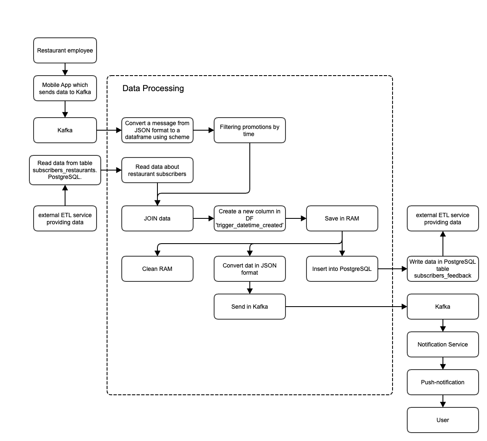

# The 8th Project

### Description
The food delivery aggregator is gaining popularity and is introducing a new option - subscription. It opens up a number of possibilities for users, one of which is to add restaurants to favorites. Only then will the user receive notifications about special promotions with a limited period of validity. A system that will help implement this update will need to be created here.

The system works like this:
1. The restaurant sends a limited-time promotion through its mobile app. For example, something like this: “Here’s a new dish - it’s not on the regular menu. We are giving a 70% discount on it until 14:00! Every comment about the new product is important to us.”
2. The service checks which user has a restaurant in their favorites list.
3. The service generates templates for push notifications to these users about temporary promotions. Notifications will only be sent while the promotion is valid.

The task is to pick up messages from Kafka, process them and send them to two receivers: a Postgres database and a new topic for the kafka broker.

### Schema


### Action Plan

- [x] Read data from Kafka using Spark Structured Streaming and Python in real time.

- [x] Get a list of subscribers from a Postgres database.

- [x] Join data from Kafka with data from the database

- [x] Store the received data in memory so as not to reassemble it after sending it to Postgres or Kafka.

- [x] Send an output message to Kafka with information about the promotion, the user with a list of favorites and the restaurant, and also insert records into Postgres to subsequently receive feedback from the user. The push notification service will read messages from Kafka and generate ready-made notifications.

```json
{"restaurant_id": "123e4567-e89b-12d3-a456-426614174000","adv_campaign_id": "123e4567-e89b-12d3-a456-426614174003","adv_campaign_content": "first campaign","adv_campaign_owner": "Ivanov Ivan Ivanovich","adv_campaign_owner_contact": "iiivanov@restaurant.ru","adv_campaign_datetime_start": 1659203516,"adv_campaign_datetime_end": 2659207116,"datetime_created": 1659131516}
```

### Kcat commands

```
# read message from the topic OUT
kafkacat -b rc1b-2erh7b35n4j4v869.mdb.yandexcloud.net:9091 \
-X security.protocol=SASL_SSL \
-X sasl.mechanisms=SCRAM-SHA-512 \
-X sasl.username="de-..." \
-X sasl.password="..." \
-X ssl.ca.location=/usr/local/share/ca-certificates/Yandex/YandexCA.crt \
-t project8.mmakarov_out  \
-K \
-C 
```

```
# send message to the IN topic
kafkacat -b rc1b-2erh7b35n4j4v869.mdb.yandexcloud.net:9091 \
-X security.protocol=SASL_SSL \
-X sasl.mechanisms=SCRAM-SHA-512 \
-X sasl.username="de-..." \
-X sasl.password="..." \
-X ssl.ca.location=/usr/local/share/ca-certificates/Yandex/YandexCA.crt \
-t project8.mmakarov_in \
-K: \
-P 
key:{"restaurant_id": "123e4567-e89b-12d3-a456-426614174000","adv_campaign_id": "123e4567-e89b-12d3-a456-426614174003","adv_campaign_content": "first campaign","adv_campaign_owner": "Ivanov Ivan Ivanovich","adv_campaign_owner_contact": "iiivanov@restaurant_id","adv_campaign_datetime_start": 1659203516,"adv_campaign_datetime_end": 2659207116,"datetime_created": 1659131516}
```

### Check the local Postgres database

```bash
psql -h localhost -p 5432 -d de -U jovyan
```

```sql
select * from subscribers_feedback;
```

### Repository structure

There are two sub-folders inside `src`:
- `/src/pics`;
- `/src/scripts`.
