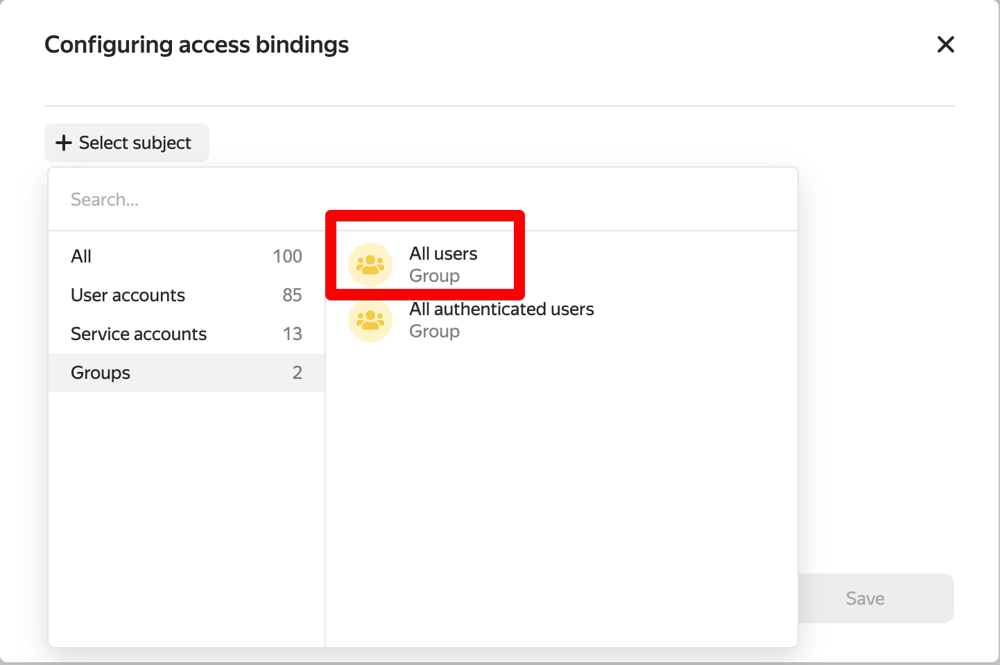
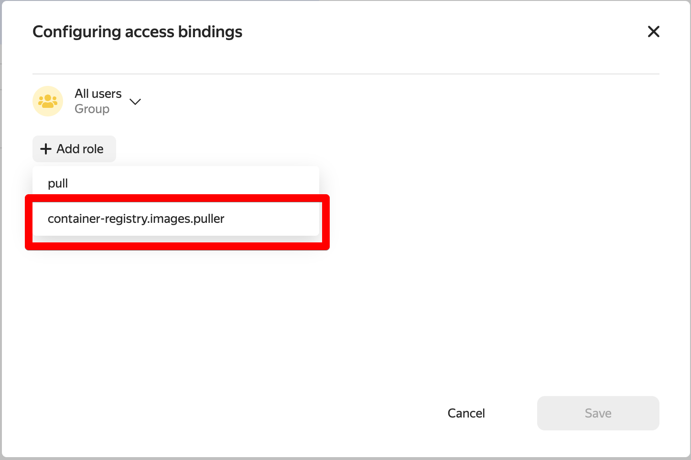

# Helm-чарт для установки приложения в Kubernetes

После успешной аутентификации в кластере склонируйте репозиторий этого чарта к себе на компьютер.

В файле `app/values.yaml` измените значения переменных. Укажите ссылку на реджистри, созданного в Yandex Cloud и версию образа:

```yaml
image:
  repository: "адрес образа в формате cr.yandex/<registry id>/<repo name>"
  pullPolicy: IfNotPresent
  # Overrides the image tag whose default is the chart appVersion.
  tag: "версия образа в реджистри"
```

Установите Helm-чарт:

```shell
helm upgrade --install --atomic test app
```

## Настройка реджистри Yandex Cloud

Для разрешения возможности пуллинга образов из вашего реджисти, настройте политику доступа. Нужно выдать роль `container-registry.images.puller` на ваш реестр для системной группы allUsers.

В настройках реджистри нажмите "Назначить роли" в правом верхнем углу и выберите группу "All Users":



Назначте этой группе роль `container-registry.images.puller`:



## Работа с Helm

```
# running helm deployments
helm ls -a -n c08-maksim-makarov
```

```
# uninstall deployemnt 
helm delete stg-service -n c08-maksim-makarov
helm delete test-demo -n c08-maksim-makarov
```

```
# install deployment with helm
helm install test-demo /Users/max/Documents/practicum/sprint-9/sprint9-demo-service/de_cloudtech_demo_service/app -n c08-maksim-makarov
```

```
# install deployment
helm upgrade --install stg-service /Users/max/Documents/GitHub/de-project-sprint-9/solution/service_stg/app -n c08-maksim-makarov
```

```
# docker
cd /Users/max/Documents/GitHub/de-project-sprint-9/solution/service_stg
docker build . -t cr.yandex/crp4l665spjbrg60ja0c/stg_service:v2023-05-04-r1
docker push cr.yandex/crp4l665spjbrg60ja0c/stg_service:v2023-05-04-r1
```

```
# kafka start in
docker run \
    -it \
    --name "kcat_from-source" \
    --network=host \
    --rm \
    -v "/Users/max/Documents/practicum/sprint-9/CA.pem:/data/CA.pem" \
    edenhill/kcat:1.7.1 -b rc1a-1707194m2p4hsm7d.mdb.yandexcloud.net:9091 \
    -X security.protocol=SASL_SSL \
    -X sasl.mechanisms=SCRAM-SHA-512 \
    -X sasl.username=producer_consumer \
    -X sasl.password="adminadmin" \
    -X ssl.ca.location=/data/CA.pem \
    -t order-service_orders \
    -C \
    -o beginning 
```

```
# kafka start out
docker run \
    -it \
    --name "kcat_stg-service-orders" \
    --network=host \
    --rm \
    -v "/Users/max/Documents/practicum/sprint-9/CA.pem:/data/CA.pem" \
    edenhill/kcat:1.7.1 -b rc1a-1707194m2p4hsm7d.mdb.yandexcloud.net:9091 \
    -X security.protocol=SASL_SSL \
    -X sasl.mechanisms=SCRAM-SHA-512 \
    -X sasl.username=producer_consumer \
    -X sasl.password="adminadmin" \
    -X ssl.ca.location=/data/CA.pem \
    -t stg-service-orders \
    -C \
    -o beginning 


